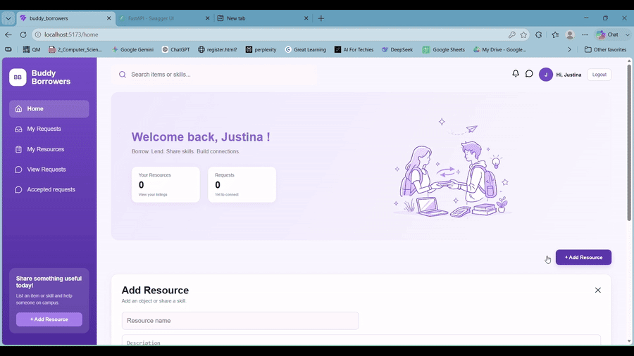
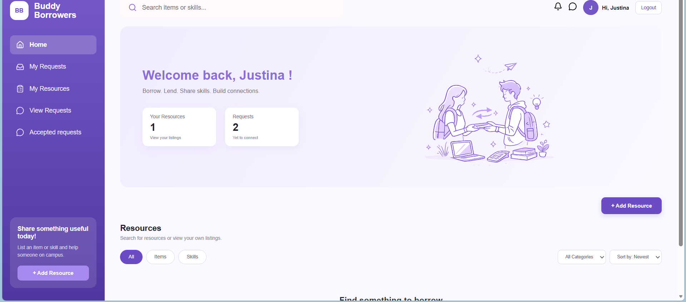
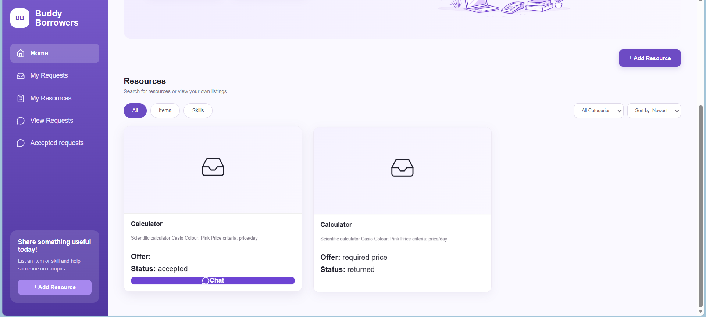
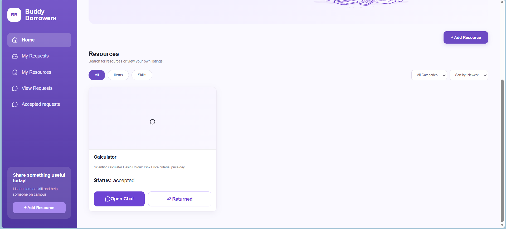

# Buddy Borrowers v1.0

Buddy Borrowers is a campus resource-sharing platform that allows students to lend and borrow everyday items or offer skills within their college community.

The goal of the project is to encourage resource sharing while providing a secure workflow for requesting, negotiating, accepting, rejecting, and returning resources.

---

## Demo



---

## Screenshots

### Dashboard



### Resource Listings



### Request & Return Workflow



---

## Key Engineering Highlights

- Designed a relational PostgreSQL database for users, resources, requests, messages, and signup verification.
- Implemented JWT-based authentication and protected API endpoints.
- Implemented authorization rules for resource ownership and borrowing actions.
- Built a complete borrowing workflow from resource request and negotiation to acceptance, return, and resource availability.
- Implemented request-based chat between lenders and borrowers.
- Integrated the React frontend with the FastAPI backend.
- Deployed the backend using Render and PostgreSQL using Neon.


---

## Features

### Authentication

- Email verification during signup
- JWT-based authentication
- Secure login
- Protected API endpoints

### Resource Management

- Add new resources
- Edit existing resources
- Delete resources
- Search available resources
- View your own listings

### Borrowing Workflow

- Request a resource
- Accept or reject requests
- Return borrowed resources
- Track request status

### Chat

- Request-based chat between lender and borrower
- Conversations linked to each borrowing request

---

## Tech Stack

### Backend

- FastAPI
- PostgreSQL
- Psycopg
- JWT Authentication
- Pydantic

### Frontend

- React
- Axios
- React Router
- CSS
- Lucide React Icons

### Deployment

- Backend: Render
- Database: Neon PostgreSQL

---

## Database Design

The application uses a relational database consisting of:

- Users
- Resources
- Requests
- Messages
- Pending Signup Verification

Relationships are maintained using foreign keys to ensure data consistency.

---

## Request Workflow

```text
                    User
                     │
        ┌────────────┴────────────┐
        │                         │
        ▼                         ▼
 Create Resource           Request Resource
                                  │
                                  ▼
                         Chat Opens Immediately
                     (Negotiation / Discussion)
                                  │
                                  ▼
                             Lender Decision
                           ┌────────┴────────┐
                           │                 │
                           ▼                 ▼
                        Accept           Reject
                           │                 │
                           ▼                 ▼
                  Resource Rented      Chat Blocked
                           │
                           ▼
                    Resource Returned
                           │
                           ▼
                  Resource Available Again
```


---

## Project Structure

```
backend/
    auth.py
    db.py
    main.py
    routes/

frontend/
    src/
    components/
    pages/
```

---

## Running Locally

### Clone

```bash
git clone https://github.com/justina-os/buddy_borrowers_backend.git
```

### Backend

```bash
cd backend

python -m venv venv

pip install -r requirements.txt

uvicorn main:app --reload
```

### Frontend

```bash
cd frontend

npm install

npm run dev
```

---

## Environment Variables

Backend

```env
DATABASE_URL=
JWT_SECRET=
EMAIL_ADDRESS=
EMAIL_PASSWORD=
```

Frontend

```env
VITE_API_URL=
```

---

## Future Improvements (V2)

- Real-time chat using WebSockets
- Notifications
- Image uploads for resources
- User profiles
- Ratings and reviews
- Better frontend state management
- Responsive mobile interface

---

## What I Learned

Building Buddy Borrowers helped me gain practical experience with:

- Designing REST APIs using FastAPI
- JWT authentication
- PostgreSQL database design
- React and backend integration
- Managing application state
- Deployment using Render and Neon
- Building a complete full-stack application from scratch

---

## Development Notes

The backend architecture, database design, API implementation, business logic, and deployment were designed and implemented by me.

The React frontend was developed with AI-assisted code generation and guidance. I integrated the frontend with the backend, adapted the generated code to match the API, and debugged the application throughout development.
## Author

Justina

Second-year AIML Student
